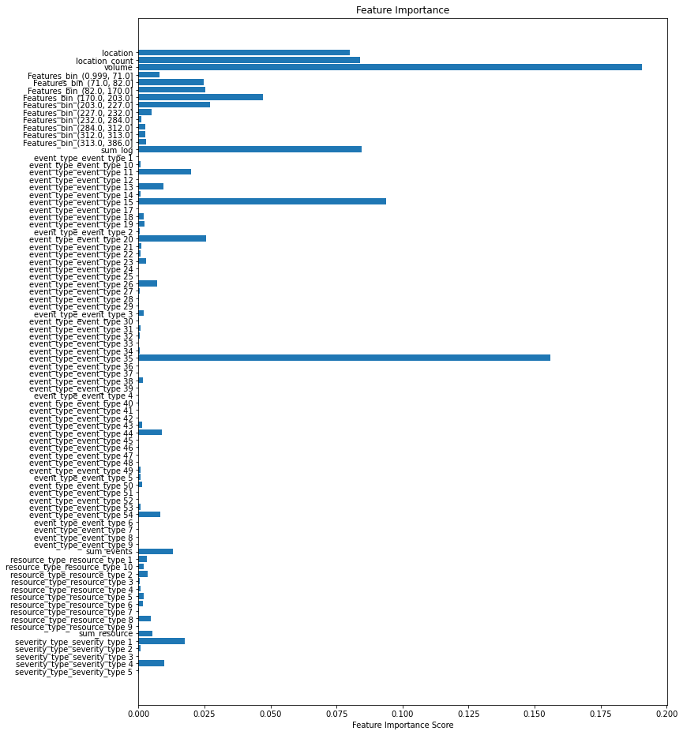
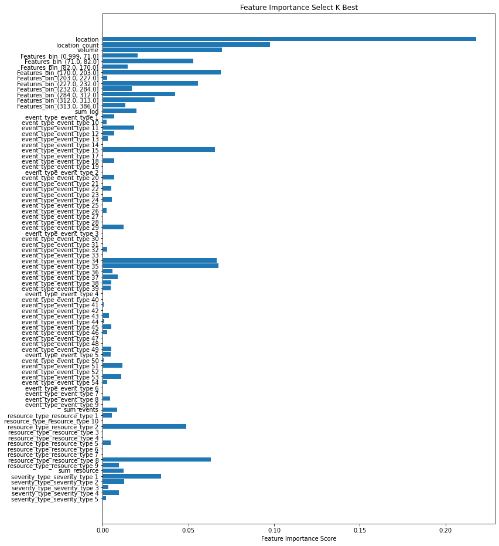
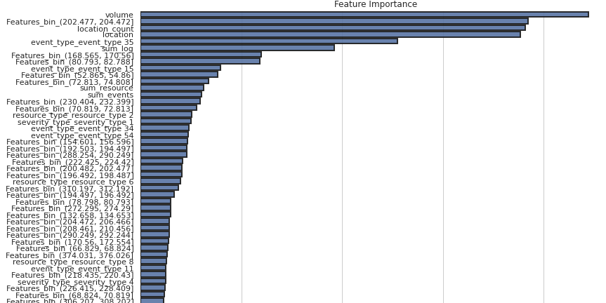
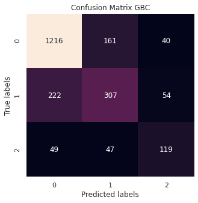
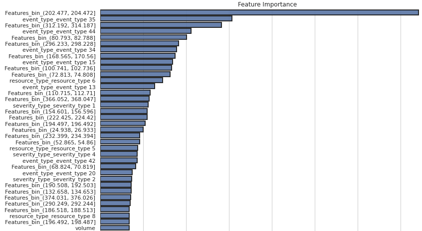

# Telstra-Network-Disruptions

Este repositorio es una contribución personal a la competencia en Kaggle [**Telstra Network Disruptions**](https://www.kaggle.com/c/telstra-recruiting-network/overview), cuyo objetivo es predecir la severidad de las interrupciones en su servicio, se tiene la tarea de predecir si una interrupción es una falla momentánea o una interrupción total de la conectividad.

En este mismo se expone el proceso en su totalidad, desde el desglose de los datos, hasta los resultados finales.

## Entendimiento del negocio
  
Telstra es una empresa especializada en telecomunicaciones ubicada en Australia, siendo el mayor proveedor de telefonía, tanto local, como de larga distancia, de servicios de telefonía móvil, acceso telefónico, conexiones inalámbricas, DSL y acceso a Internet por cable en Australia.

Como en cualquier empresa que involucre infraestructura computacional, mantenimiento, crecimiento en la capacidad de brindar sus servicios y tecnología de punta, entre otras características, suelen presentarse fallas; estas pueden ser desde ligeras hasta muy severas. En un mundo donde la conectividad es imprescindible, identificar estas fallas y sus posibles causas, es vital para repararlas en el menor tiempo posible y brindar una mejor calidad en todos los servicios.

Una combinación de causas, ya sean estas individuales o diversas pueden llevar a un mismo tipo de falla o severidad en la interrupción del servicio, una vez clasificadas, la pregunta a contestar es: ¿qué factores causan cada tipo de falla? para de esta manera prevenirlas. 

Para contestar esta pregunta, Telstra pone a disposición del publico una simulación de los datos generados al producirse un tipo de falla, con el objetivo de crear un modelo predictivo clasificatorio.

## Comprensión de los datos

El objetivo del problema es predecir la gravedad de la falla de la red de Telstra en una ubicación particular en función de los datos de registro disponibles. Los datos proporcionados se segmentan en diferentes data sets, unidos entre sí por medio de un 'id’.

  - train.csv:  Set de datos para entrenar al algoritmo, contiene tres columnas.

  - test.csv: Set de datos para realizar las predicciones y subir los resultados, contiene dos columnas.
  
  - event_type.csv:  Tipo de evento relacionado con el conjunto de datos principal.

  - log_feature.csv: características extraídas de los archivos de registro.

  - resource_type.csv: tipo de recurso relacionado con el conjunto de datos principal.

  - severity_type.csv: tipo de gravedad de un mensaje de advertencia procedente del registro.

## Inspección los datos.

### [train.csv](https://github.com/Mahonry/Telstra-Network-Disruptions/blob/master/Datasets_challenge/train.csv)

    Tamaño: (7381, 3) 
    
    7831 registros para entrenar el algoritmo.

    Columnas:
        - id: Identificador único por falla.
        - location: Locación donde se dio la falla. (Variable Categórica)
        - fault_severity: Clasificación de la falla. 
    
    7831 Valores únicos en id
    929 Valores únicos en location
    
    Distribución por fault_severity:

    0    64.81%
    1    25.34%
    2     9.83%

    Muestra de la distribución por location:

    location 821     9.149623%
    location 1107    8.396125%
    location 734     8.073197%
    location 1008    7.642626%
    location 126     7.642626%

- **Por la distribución de los datos nos damos cuenta de que tenemos un problema de clasificación multiclase, pero que estas desbalanceadas, ya que solo el 9.8 % de los registros pertenecen a una falla del tipo 2.**

- El data set no contiene más información, las características vendrán dadas al hacer las uniones con los demás data sets.

- Sin valores nulos.

### [test.csv](https://github.com/Mahonry/Telstra-Network-Disruptions/blob/master/Datasets_challenge/test.csv)

    Tamaño: (11171, 2)

    Columnas:
        - id: Identificador único por falla.
        - location: Locación donde se dio la falla.

    11171 Valores únicos en id.
    1039 Valores únicos por location.

    Muestra de la distribución por location:

    location 734     10.490857
    location 653     10.394610
    location 126     10.202117
    location 1107    10.202117
    location 810      9.817132
    
    Total data (train + test):   18552

- Sin valores nulos.

### [even_type.csv](https://github.com/Mahonry/Telstra-Network-Disruptions/blob/master/Datasets_challenge/event_type.csv)

    Tamaño (31170, 2)

    Columnas:
        - id: Identificador único por falla.
        - event_type: Tipo de evento (Variable categórica)
    
    53 Valores únicos en event_type
    18552 Valores únicos en id

    Muestra de la distribución:

    event_type 11    25.306384%
    event_type 35    21.222329%
    event_type 34    19.015079%
    event_type 15    14.100096%
    event_type 20     4.677575%

- Contiene el mismo número de id's que Total data (train + test), sin embargo, el número de registros totales es 311170 lo que sugiere que hay más de un evento por id.

- Sin valores nulos.

### [log_feature.csv](https://github.com/Mahonry/Telstra-Network-Disruptions/blob/master/Datasets_challenge/log_feature.csv)

    Tamaño (58671, 3)

    Columnas: 
        - id: Identificador único por falla.
        - log_feature: característica sin mayor descripción (Variable categórica)
        - volume: característica sin mayor descripción (Variable numérica)

    18552 Valores únicos en id 
    386 Valores únicos en log_feature
    341 Valores únicos en volume

    Muestra de la distribución en log_feature:

    feature 312    8.977178%
    feature 232    8.102811%
    feature 82     5.917745%
    feature 203    4.811576%
    feature 313    3.655980%

- Contiene el mismo número de id's que Total data (train + test), sin embargo, el número de registros totales es 58671 lo que sugiere que hay más de un evento por id.

- Sin valores nulos

### [resource_type.csv](https://github.com/Mahonry/Telstra-Network-Disruptions/blob/master/Datasets_challenge/resource_type.csv)

    Tamaño (21076, 2)

    Columnas:
        - id: Identificador único por falla.
        - resource_type: Tipo de recurso (Variable categórica)
    
    10 Valores únicos en resource_type
    18552 Valores únicos en id

    Muestra de la distribución:

    resource_type 4      1.565762%
    resource_type 7      2.362877%
    resource_type 6      2.761435%
    resource_type 2     42.313532%
    resource_type 8     48.718922%

- Contiene el mismo número de id's que Total data (train + test), sin embargo, el número de registros totales es 21076 lo que sugiere que hay más de un recurso por id.

- Sin valores nulos

### [severity_type.csv](https://github.com/Mahonry/Telstra-Network-Disruptions/blob/master/Datasets_challenge/severity_type.csv)

    tamaño: (18552, 2)

    Columnas:
        - id: Identificador único por falla.
        - severity_type: A menudo, este es un tipo de gravedad de un mensaje de advertencia proveniente del registro. (Variable categórica)
    
    5 Valores únicos en severity_type
    18552 Valores únicos en id

    Distribución:

    severity_type 1    47.046141%
    severity_type 2    47.094653%
    severity_type 3     0.043122%
    severity_type 4     5.465718%
    severity_type 5     0.350367%

- Contiene el mismo número de id's que Total data (test + train) y contiene 18552 registros lo que sugiere que se asocia solo un tipo de 'severity_type' por id.

- Sin valores nulos

## Preparación de los datos.

Todo el proceso de preparación de los datos puede verse en el notebook [Data_Preparation](https://github.com/Mahonry/Telstra-Network-Disruptions/blob/master/Data_Preparation.ipynb).

Los data sets generados pueden verse en la carpeta [Data extraida](https://github.com/Mahonry/Telstra-Network-Disruptions/tree/master/Data%20extraida).

Se generaron 3 data sets con diferentes features, para probar su desempeño en los modelos, los 3 se crearon de manera similar, a continuación, explicaré los pasos comunes para consolidarlos:

1._ Para los data sets, 'even_type.csv','resource_type.csv' y 'severity_type.csv.' se agrupan las columnas de variables categóricas por 'id'.

2._ De nuevo para los data sets, even_type.csv','resource_type.csv' y 'severity_type.csv.' una vez agrupadas las variables categóricas, se aplica el método get_dummies () de la librería pandas, para obtener una columna con cada variable y el conteo de cuantas veces se repitió esa variable en el id.

3._ Se agrega una columna con la suma del total de variables que se contabilizaron para ese 'id'.

4._ Se cuentan las frecuencias de las locaciones para los data set 'train.csv' y 'test.csv' se agrega una columna con el total.

5._ Se convierten los datos de las locaciones de los data sets 'train.csv' y 'test.csv' a numéricos por medio de la función label_enconder ().

6._ Se consolidan los data sets creando merge por id con los data sets 'train.csv' y 'test.csv'.

El procedimiento difiere para los data sets en lo siguiente:

- En los data sets ['train_1'](https://github.com/Mahonry/Telstra-Network-Disruptions/blob/master/Data%20extraida/train_1.csv) y ['test_1'](https://github.com/Mahonry/Telstra-Network-Disruptions/blob/master/Data%20extraida/test_1.csv) se utilizó log['Features_bin'] = pd.qcut(log.log_feature, 10) agrupando la variable categórica 'log_feature' en 10 grupos percentiles, el número total de features en estos data sets es de 84.

- En los data sets ['train_2'](https://github.com/Mahonry/Telstra-Network-Disruptions/blob/master/Data%20extraida/train_2.csv) y ['test_2'](https://github.com/Mahonry/Telstra-Network-Disruptions/blob/master/Data%20extraida/test_2.csv) se utilizó log['Features_bin'] = pd.cut (log.log_feature, 193) para reducir a la mitad la cantidad de features dadas por 'log_feature',
el número total de features en estos data sets es de 269.

- En los data sets ['train_consolidado_completo'](https://github.com/Mahonry/Telstra-Network-Disruptions/blob/master/Data%20extraida/train_consolidado_complete.csv) y ['test_consolidado_completo'](https://github.com/Mahonry/Telstra-Network-Disruptions/blob/master/Data%20extraida/test_consolidado_complete.csv) se aplicó el método get_dummies () a todas las features incluidas las locaciones y 'log_feature', el número total de features en este data set es de 1390.

## Modelado y Evaluación

Dispuse diferentes modelos y pruebas , ya que, con el primer prototipo de modelo, obtuve un puntaje en Kaggle que cumplía con el requisito de ser menor a 0.7, propuse bajar esta cifra lo máximo posible mientras aún existiera tiempo, a continuación describo la forma en la cual alcancé mi mejor puntaje (0.54013)  y la manera de evaluar los modelos entrenados.

**Consideraciones importantes**

- Me concentré en evaluar y mejorar los modelos con la métrica 'multi-class logaritmic loss' ya que sería esta la que Kaggle usaría para puntuar mis predicciones.

- Ya que era un problema con clases desequilibradas, se les debía prestar especial atención a estas y usar una métrica correcta para los modelos finales, consideré la matriz de confusión y la métrica recall.

### [Primer prototipaje](https://github.com/Mahonry/Telstra-Network-Disruptions/blob/master/Primer_prototipaje.ipynb)

En este notebook, realicé las primeras pruebas, con el objetivo de observar el rendimiento de diferentes clases de algoritmos con distintos data sets; por otra parte, el rendimiento no fue mi principal prioridad, sino obtener un panorama general para después optimizarlo. 

En general, seleccioné cuatro modelos funcionales para las clasificaciones multiclase y con los que además ya estuviera familiarizado, para poder comprender mejor su función, estos algoritmos fueron:

* Random Forest Classifier (RF)

* Gradient Boosting Classifier (GBC)

* Desicion Tree Classifier (DT)

* K Nearest Neighbors Classifier (KNN) 

En estas pruebas no realicé ninguna optimización de hiperparámetros, por lo que, todos los modelos fueron entrenados con los parámetros estándar.

Se pusieron a prueba los data sets 'train_1' y 'train_consolidado_completo', sin embargo, al hacer las primeras pruebas, pude percatarme de que no existía una diferencia significativa en los rendimientos, sin embargo el tiempo de entrenamiento del data set 'train_consolidado_completo'  era significativamente mayor. Debido a que mi objetivo era observar el panorama general de los rendimientos, descarté este último data set y todas las pruebas las realice con 'train_1'.

#### Primera prueba, data set sin modificaciones

    - Dividí los datos de 'train_1' en X_train, X_test, y_train, y_test con la proporción 70:30.

    - Entrene los modelos con X_train y y_train, predije con X_test y saqué las métricas 'log_loss' y el score default de los modelos que en todos es 'mean accuracy'.

    Los resultados fueron los siguientes:

    Model: RF   log_loss: 0.8315947745024285
    Model: RF   score: 0.7051918735891648
    ___________________________________________
    Model: GBC   log_loss: 0.5976638554985724
    Model: GBC   score: 0.7187358916478556
    ____________________________________________
    Model: DT   log_loss: 10.876911920615587
    Model: DT   score: 0.6785553047404064
    ____________________________________________
    Model: KNN   log_loss: 2.459482808226647
    Model: KNN   score: 0.6397291196388262

    Observamos que en una primera aproximación sin modifica las features 
    o realizar selección de componentes principales los modelos con mejor 
    performance son: Random Forest y Gradient Boosting Classifier, 
    siendo este último el que obtuvo la menor perdida.

#### Segunda prueba, reescanlando los datos

    - Realice los mismos pasos que en el punto anterior, pero esta vez escale los datos en train, con la función StandardScaler.

    Los resultados fueron los siguientes:

    Model: RF   log_loss: 0.7614260921343133
    Model: RF   score: 0.709255079006772
    ________________________________________
    Model: GBC   log_loss: 0.5976547758516163
    Model: GBC   score: 0.7182844243792325
    ________________________________________
    Model: DT   log_loss: 10.798320418883904
    Model: DT   score: 0.6808126410835215
    ________________________________________
    Model: KNN   log_loss: 2.9901517056875164
    Model: KNN   score: 0.6735891647855531
    ________________________________________

    Vemos nuevamente que la menor perdida la tuvo el Gradient Boosting Classifier, 
    sin embargo, no hubo un descenso significativo en comparación a la iteración anterior

#### Análisis de features

Una característica de los algoritmos Random Forest Classifier y Gradient Boosting Classfier es que devuelven la relevancia de features, por esta razón me llamó la atención analizar los features más relevantes para el Gradient Boosting Classifier y compararlos con una técnica de selección de features automática 'SelectKBest'.

- Visualicé la relevancia de features para el Gradient Boosting Classfier.

  

- Entrené el selector automático 'SelectKBest' con k = 64 y las visualicé.

  

- Comparé si estos dos mecanismos habían elegido las mismas features relevantes, coincidieron en 10 features.

#### Tercera prueba, Selección automática de features y escalamiento de datos

    - De igual manera escalé los datos,
     pero use el selector automático para que seleccionara
     las features, los resultados son los siguientes:

    Model: RF   log_loss: 0.7117107542202854
    Model: RF   score: 0.7033860045146727
    ________________________________________
    Model: GBC   log_loss: 0.5975829761383757
    Model: GBC   score: 0.7200902934537246
    ________________________________________
    Model: DT   log_loss: 10.844786866741318
    Model: DT   score: 0.6799097065462754
    ________________________________________
    Model: KNN   log_loss: 2.9273783436843583
    Model: KNN   score: 0.6762979683972912
    ________________________________________

#### Analizando rendimientos

Una vez obtenidos todos estos rendimientos, seleccioné el modelo que tuviera la menor medida en la métrica 'log_loss' que fue Gradient Boosting Classifier y además este mismo tenía el mejor score, por lo que, seleccionée este modelo para optimizarlo, sin embargo, con estas condiciones, realice una primera predicción ['Submission_1'](https://github.com/Mahonry/Telstra-Network-Disruptions/blob/master/Submission/submision_1.csv) para puntuar en Kaggle.

El resultado fue:

  

### [Gradient Boosting Classifier](https://github.com/Mahonry/Telstra-Network-Disruptions/blob/master/Gradient_Boosting_Classifier.ipynb) 

Una vez teniendo un modelo base me propuse mejorarlo, aquí hay varios puntos a notar:

- Me propuse a hacer una optimización de hiperparámetros para el Gradient Boosting Classifier (GBC) con la intención de mejorar el rendimiento en la métrica 'log_loss'.

- Aquí realicé una visualización más exhaustiva del rendimiento, que describiré más adelante.

- En la sección anterior me di cuenta de que no existían diferencias notorias entre los data sets 'train_1' y 'train_consolidado_completo', sin embargo, pude observar que en train 1 se perdía  información con el análisis de features de la sección anterior, me percaté de que se les daba una gran importancia a los features  creadas con los datos de 'log_feature.csv', mi razonamiento fue que el hecho de haber creado tan solo 10 grupos percentiles no había sido la opción más viable,sin embargo, tampoco existía una gran diferencia en conservar todas las categorías, por lo que probé reducirlas a la mitad.

- Me decidí crear los data sets 'train_2' y 'test_2' y ponerlos a competir con 'test_1' y 'train_1', probando diferentes combinaciones de hiperparámetros para observar si mejoraba el rendimiento.

- Realicé las pruebas con los data sets 'train_1' y 'train_2' sin modificar y también escalando los datos con StandardScaler (), así que estas fueron hechas sobre 4 data sets. 

#### Explorando 'Learning Rate'

    Exploré el desempeño del GBC
    modificando el hiperparámetro learning rate, 
    el rango de prueba fue [1, 0.5, 0.25, 0.1, 0.05, 0.01].

    Los resultados fueron:

    learning_rate: 1
    log_loss_normal: 0.6757316523244108
    log_loss_scaled: 0.6757072990224782
    log_loss_normal_2: 0.6731948213472368
    log_loss_scaled_2: 0.6691173692772026
    ________________________________________
    learning_rate: 0.5
    log_loss_normal: 0.5802708636613513
    log_loss_scaled: 0.5764201985351942
    log_loss_normal_2: 0.5474870295504296
    log_loss_scaled_2: 0.5519166097659621
    ________________________________________
    learning_rate: 0.25
    log_loss_normal: 0.5569741356595201
    log_loss_scaled: 0.557221732741579
    log_loss_normal_2: 0.5374604996918831
    log_loss_scaled_2: 0.5364652059653995
    ________________________________________
    learning_rate: 0.1
    log_loss_normal: 0.5797996081563771
    log_loss_scaled: 0.5797144138923297
    log_loss_normal_2: 0.5585793495023701
    log_loss_scaled_2: 0.5587060488611008
    ________________________________________
    learning_rate: 0.05
    log_loss_normal: 0.6049939845752661
    log_loss_scaled: 0.605001253676208
    log_loss_normal_2: 0.5809677668007277
    log_loss_scaled_2: 0.5809793431340788
    ________________________________________
    learning_rate: 0.01
    log_loss_normal: 0.6958062427653955
    log_loss_scaled: 0.6958062316152474
    log_loss_normal_2: 0.6785354718923399
    log_loss_scaled_2: 0.6785289041764625
    ________________________________________

    Se observa una sutil pero notable diferencia entre los data sets, 
    siendo 'train_2' el que mejor rendimiento tienen en el learning rate 0.25.

#### Explorando 'n_estimators'

    De nuevo realicé una exploración, 
    pero ahora modificando el hiperparámetro
    'n_estimators' en el rango [100,300,500,700]

    n_estimators: 100
    log_loss_normal: 0.5796424729936192
    log_loss_scaled: 0.5798056319358651
    log_loss_normal_2: 0.5587139918649036
    log_loss_scaled_2: 0.5588190808155445
    ________________________________________
    n_estimators: 300
    log_loss_normal: 0.5533659195969174
    log_loss_scaled: 0.5533006753202276
    log_loss_normal_2: 0.533847794842595
    log_loss_scaled_2: 0.5337433042844643
    ________________________________________
    n_estimators: 500
    log_loss_normal: 0.5524969095129266
    log_loss_scaled: 0.5527578162081834
    log_loss_normal_2: 0.5320054979300892
    log_loss_scaled_2: 0.532043406583292
    ________________________________________
    n_estimators: 700
    log_loss_normal: 0.5586118723180455
    log_loss_scaled: 0.5592284020427745
    log_loss_normal_2: 0.5371383023999352
    log_loss_scaled_2: 0.5367254063234762
    ________________________________________

    Con 500 obtuve la menor pérdida.

Adicionalmente, modifiqué algunos otros parámetros de forma individual, para observar los rendimientos en cuando a los data sets. Conclusión: el data set 2 tiene el mejor desempeño, se debe proceder a realizar una búsqueda exhaustiva para obtener el modelo final.

#### Análisis de resultados

Luego de realizar la búsqueda exhaustiva , obtuve la combinación más eficaz de hiperparámetros, también entrené el modelo y realicé la ['submission_2'](https://github.com/Mahonry/Telstra-Network-Disruptions/blob/master/Submission/submission_2.csv), que puntuó en Kaggle con el siguiente score:

   

Sin embargo, en este punto fui más exhaustivo y analicé con mayor profundidad resultados dados por este modelo.

Comencé el análisis prestando mayor atención en la importancia de features dadas por el mismo modelo, a continuación, pongo una muestra.

   

De estos datos concluí que mi intuición fue acertada en lo que respecta al log_feature', ya que la mayoría de estas tuvieron una mayor relevancia según la puntuación, a pesar de no ser las más relevantes.

A continuación se observa la matriz de confusión

   

Posteriormente, llegamos a un punto interesante y a formular la siguiente pregunta: ¿qué tan eficazmente predice las etiquetas este modelo?, a continuación muestro el clasificación report':

              precisión    recall  f1-score   support

           0       0.82      0.85      0.83      1417
           1       0.58      0.53      0.56       583
           2       0.56      0.53      0.54       215

    accuracy                               0.74      2215
    macro avg          0.65      0.64      0.65      2215
    weighted avg       0.73      0.74      0.73      2215

A pesar de que este modelo obtuvo un mejor puntaje en la métrica 'log_loss', vemos que está teniendo problemas para predecir las etiquetas de tipo 1 y 2, lo cual es totalmente lógico ya que nuestras clases están desequilibradas y el modelo no tiene suficientes datos para generalizar.

La métrica recall es un buen estimador de cómo se desempeña nuestro modelo por clase, ya que puede interpretarse como: número de predicciones correctas entre el total de elementos de la clase, como las clases están desequilibradas observamos que en general para las clases [1, 2] solo podemos obtener recuperar aproximadamente 50% de predicciones correctas.

### [XGBoost](https://github.com/Mahonry/Telstra-Network-Disruptions/blob/master/XGBoost.ipynb)

Buscando mejorar mi puntuación en Kaggle, probé un nuevo algoritmo con la misma base que el anterior, llamado Extreme Gradient Boosting Classificator (XGBoost), este algoritmo es una versión mejorada del GBC.

XGBooost (Extreme Gradient Boosting) es una implementación específica del método Gradient Boosting que utiliza aproximaciones más precisas para encontrar el mejor modelo. Emplea una serie de ingeniosos trucos que lo hacen excepcionalmente exitoso, particularmente con datos estructurados. Los más importantes son:

1.) Calcular gradientes de segundo orden, es decir, segundas derivadas parciales de la función de pérdida, que proporciona más información sobre la dirección de los gradientes y cómo llegar al mínimo de nuestra función de pérdida. 

2.) Y la regularización avanzada (L1 y L2), que mejora la generalización del modelo.

De igual manera realicé algunas experimentaciones para probar el rendimiento, en este caso por cuestiones de tiempo no optimize los hiperparámetros de manera exhaustiva y solo probé con algunas combinaciones aleatoria, para buscar la combinación que mejor se desempeñara ['submission_3'](https://github.com/Mahonry/Telstra-Network-Disruptions/blob/master/Submission/submission_3.csv) que puntuó en Kaggle con el siguiente score:

   

A continuación, igual que en el punto anterior, expongo la matriz de confusión y el reporte clasificatorio:

   

              precision    recall  f1-score   support

           0       0.82      0.86      0.84      1417
           1       0.60      0.53      0.56       583
           2       0.56      0.55      0.56       215

    accuracy                            0.74      2215
    macro avg       0.66      0.65      0.65      2215
    weighted avg    0.73      0.74      0.74      2215

De estos datos concluimos lo siguiente:

- La diferencia entre las puntuaciones de Kaggle no fue tan significativa, ambos modelos GBC y XGBoost mostraron un rendimiento similar.

- En cuanto a la métrica recall tampoco se muestran diferencias significativas, por lo que, XGBoost de igual manera presenta problemas por el desequilibrio de clases.

- Es posible que haya una mejor selección de hiperparámetros para XGBoost ya que no realicé una búsqueda exhaustiva de los mejores, solo probé combinaciones aleatorias.

Sin embargo, la diferencia significativa entre GBC y XGBoost viene en la relevancia de features, a continuación se encuentra la muestra de XGBoost:

   

 

## Conclusiones  y comentarios finales
### Conclusiones:
-	Ambos modelos finales GBC y XGBoost tienen rendimientos similares, pero con  diferente relevancia de features, lo que sugiere que podría haber alguna otra combinación de features que dieran mejor rendimiento a los modelos.
-	Ambos modelos son buenos prediciendo etiquetas del tipo 0, sin embargo, tienen problemas al predecir etiquetas de los tipos 1 y 2, que son las que tienen una mayor relevancia para Telstra.
-	La característica ‘log_feature’ fue significativa para el rendimiento de los modelos.
-	Más que enfocarse en el perfeccionamiento de los algoritmos en sí, considero que una forma de hacer más eficaz el rendimiento es usando una mejor selección de features e ingeniería con estas.

### Comentarios:
-	Al comparar los resultados que obtuve con los de participantes en la competencia de Kaggle, concluyo que mi rendimiento se encuentra aproximadamente entre los 50% mejores
-	Los modelos ya entrenados pueden encontrarse en la carpeta [Models.](https://github.com/Mahonry/Telstra-Network-Disruptions/tree/master/models)

### Por mejorar:

A continuación, describo los siguientes pasos que huebiese tomado con el fin de mejorar las predicciones:
-	Probar con otro tipo de algoritmo clasificatorio o redes neuronales.
-	Tratar de encontrar patrones escondidos dentro de las features dadas.
-	Usar algunas técnicas como ‘Up-sample Minority Class’ o ‘Down – sample Majority Class’ para tratar de balancear las clases.	

